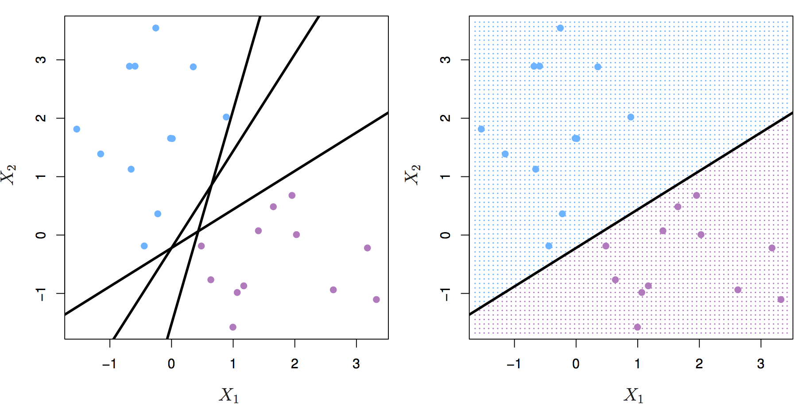

## Top Big Tech Data Science Questions 


Hello everyone, today I will discuss some interesting  Data Science Questions that may be asked in  the  largest Big Tech companies

Usually FAANG is an acronym used to describe some of the most prominent companies in the tech sector.  FANG is a group of high performing technology stocks that includes Facebook, Amazon, Netflix, and Google (Alphabet). Investors then added Apple into the list to form the acronym FAANG.

Big Tech, also known as the Tech Giants, Big Four, or Big Five, is a name given to the presently four or five largest, most dominant, and most prestigious companies in the information technology industry of the United States.


# Data Science Questions 

In the following sections we are going to answer several questions that are important in Data Science projects in the IT industry.

# Part 1 

### 1. What is the difference between supervised and unsupervised machine learning and give examples of both?

**The main difference** between supervised and unsupervised machine learning is in **data labeling**.

##### Supervised learning

Supervised learning **uses labeled input and output datasets**, which give the model the instructions when training the algorithms.

**The examples of supervised learning:**

- Decision Tree
- Logistic Regression
- Linear Regression
- Support-Vector Machine...

##### Unsupervised learning

Unsupervised learning **doesn't use the labeled datasets**, which means the models work independently to discover information hidden in the datasets.

**The examples of unsupervised learning:**

- K-Means Clustering
- Hierarchical Clustering
- Apriori Algorithm
- Principal Component Analysis

### 2. What is churn? How can we predict if a person is churning?

A **churn or attrition** is the number of customers that stop doing business with a company in terms of stopping buying their products, using their app, canceling, or not renewing their subscription. These are the customers the business has lost.

In business, churn is usually presented as a **churn rate**. The churn rate is a ratio or percentage between the number of customers lost in the period divided by the number of customers at the beginning of the period.

You can treat churn as a classification problem or an anomaly. The methods of predicting if a person is churning depend on that.

**Predict churn - as a classification problem**:

- Logistic Regression
- Naive Bayes
- Random Forest
- Decision Trees
- Support-Vector Machine
- K-Nearest Neighbour...

**Predict churn - as an anomaly**:

- Multivariate Gaussian Distribution
- Clustering...

### 3. Suppose you have a categorical dependent variable and a mixture of continuous and categorical independent variables, what type of tools/algorithms/methods you could apply for analysis?

If we have a categorical dependent variable, then we have a classification problem. There are a lot of machine learning models that we can use to solve classification problems, such as:

- Logistic regression
- Support vector machine (SVM)
- Tree-based classifiers (decision tree, random forest)
- k-Nearest Neighbors (KNN)
- Gradient Boosting
- Neural Networks.

### 4. What do you understand about linear regression?

Linear regression helps in understanding the linear relationship between the dependent and the independent variables. Linear regression is a supervised learning algorithm, which helps in finding the linear relationship between two variables. One is the predictor or the independent variable and the other is the response or the dependent variable. In Linear Regression, we try to understand how the dependent variable changes w.r.t the independent variable. If there is only one independent variable, then it is called simple linear regression, and if there is more than one independent variable then it is known as multiple linear regression.

### 5. How could unsupervised learning be used as a preprocessing step for supervised learning?

To identify multicollinearity--> can help with feature selection in relation to target variable. PCA outlier detection.

### 6. What is the difference between regression and classification problems, and how can you convert a regression problem into a classification problem?

Classification predictive modeling problems are different from regression predictive modeling problems.

- **Classification** is the task of predicting a discrete class label.
- **Regression** is the task of predicting a continuous quantity.

There is some overlap between the algorithms for classification and regression; for example:

- A classification algorithm may predict a continuous value, but the continuous value is in the form of a probability for a class label.
- A regression algorithm may predict a discrete value, but the discrete value is in the form of an integer quantity.

Some algorithms can be used for both classification and regression with small modifications, such as decision trees and artificial neural networks. Some algorithms cannot, or cannot easily be used for both problem types, such as linear regression for regression predictive modeling and logistic regression for classification predictive modeling.

Importantly, the ways in which we evaluate classification and regression predictions vary and do not overlap, for example:

- Classification predictions can be evaluated using accuracy, whereas regression predictions cannot.
- Regression predictions can be evaluated using root mean squared error, whereas classification predictions cannot.

### 7. How to convert a regression problem to a classification problem?

In some cases, it is possible to convert a regression problem to a classification problem. For example, the quantity to be predicted could be converted into discrete buckets.

Amounts in a continuous range between 100 could be converted into 2 buckets:

- Class 0: 0 to 49
- Class 1: 50 to 100

This is often called discretization and the resulting output variable is a classification where the labels have an ordered relationship (called ordinal).

### 8. What is feature engineering?

Feature engineering is a machine learning technique that leverages data to create new variables that aren’t in the training set. It can produce new features for both supervised and unsupervised learning. Feature engineering consists of the creation, transformation, extraction, and selection of features, also known as variables. The following list provides some typical ways to engineer useful features:

1. Numerical transformations (like taking fractions or scaling)
2. Category encoder like one-hot or target encoder (for categorical data)[5]
3. Clustering
4. Group aggregated values
5. Principal component analysis (for numerical data)

### 9. What is the goal of feature engineering?

The aims of feature engineering are simplifying and speeding up data transformations to manipulate features such as that are most conducive to creating an accurate and high-perform ML algorithm. Feature engineering is required when working with machine learning models. Regardless of the quality of data and architecture, useless features could diminish the performance of ML models.

### 10. What do you understand by logistic regression?

Logistic regression is a classification algorithm that can be used when the dependent variable is binary.


Logistic regression is one of the most popular machine learning models used for solving a binary classification problem, that is, a problem where the output can take any one of the two possible values. Its equation is given by 


Where X represents the feature variable, a,b are the coefficients, and Y is the target variable. Usually, if the value of Y is greater than some threshold value, the input variable is labeled with class A. Otherwise, it is labeled with class B.


### 11. What is the Interpretation of Logistic Regression intercept?

From the equation above, we know that the coefficient of our intercept is -4.0777. To interpret the intercept of logistic regression, there is a rule of thumb that you can apply:

- If the intercept has a negative sign: then the probability of having the outcome will be < 0.5.
- If the intercept has a positive sign: then the probability of having the outcome will be > 0.5.
- If the intercept is equal to zero: then the probability of having the outcome will be exactly 0.5.

Since we have a negative sign, then we can say that if the student doesn't study at all for the exam, then the probability of them passing the exam would be below 0.5.

Intercept sign can give us insight into the probability of a positive outcome. The coefficient of hours means that, since it is statistically significant, an additional 1 hour would increase the odds of the student passing the exam by e^{1.5046}*e*1.5046 = 4.5.

### 12. Interperation of Logistic Regression coefficient

We also know that the coefficient of our feature (hours) is 1.5046. But what does this 1.5046 represent?

In general, a logistic regression coefficient represents the change in log-odds ratio for having the outcome per unit change in our feature. In other words, increasing our feature by 1 unit increases the odds ratio by e^θ*e**θ*

Using the example above, we know that the coefficient of our feature is 1.5046. Thus, we can compute the odds ratio as follows:

e^{1.5046}=4.5*e*1.5046=4.5

And we have a positive sign, which means that an increase in the hours spent studying by 1 unit (let's say one 1 hour) multiplies the odds of the student passing the exam by 4.5.

### 13. What is a confusion matrix?

It is a matrix that has 2 rows and 2 columns. It has 4 outputs that a binary classifier provides to it. It is used to derive various measures like specificity, error rate, accuracy, precision, sensitivity, and recall.

 2


The test data set should contain the correct and predicted labels. The labels depend upon the performance. For instance, the predicted labels are the same if the binary classifier performs perfectly. Also, they match the part of observed labels in real-world scenarios. The four outcomes shown above in the confusion matrix mean the following:

1. **True Positive:** This means that the positive prediction is correct.
2. **False Positive:** This means that the positive prediction is incorrect.
3. **True Negative:** This means that the negative prediction is correct.
4. **False Negative:** This means that the negative prediction is incorrect.

The formulas for calculating basic measures that comes from the confusion matrix are:

1. **Error rate**: (FP + FN)/(P + N)
2. **Accuracy**: (TP + TN)/(P + N)
3. **Sensitivity** = TP/P
4. **Specificity** = TN/N
5. **Precision** = TP/(TP + FP)
6. **F-Score** = (1 + b)(PREC.REC)/(b2 PREC + REC) Here, b is mostly 0.5 or 1 or 2.

In these formulas:

**FP** = false positive
**FN** = false negative
**TP** = true positive
**RN** = true negative

Also,

Sensitivity is the measure of the True Positive Rate. It is also called recall.
Specificity is the measure of the true negative rate.
Precision is the measure of a positive predicted value.
F-score is the harmonic mean of precision and recall

### 14. Are false positives or false negatives more important?

It depends on the case. Take covid as an example, false negative is more important because we do not want any positive case to be misclassified. FP is okay here because at least they will not spread the virus.

For detecting credit card fraud, FP is more important. if we decline a real transaction as fraud too many times, our customer will leave.

### 15. What is precision?

Precision is the most commonly used error metric is n classification mechanism. Its range is from 0 to 1, where 1 represents 100%

### 16. What do you understand about the true-positive rate and false-positive rate?

True positive rate: In Machine Learning, true-positive rates, which are also referred to as sensitivity or recall, are used to measure the percentage of actual positives which are correctly identified. Formula: True Positive Rate = True Positives/Positives False positive rate: False positive rate is basically the probability of falsely rejecting the null hypothesis for a particular test. The false-positive rate is calculated as the ratio between the number of negative events wrongly categorized as positive (false positive) upon the total number of actual events. Formula: False-Positive Rate = False-Positives/Negatives.

### 17. Mention some techniques used for sampling. What is the main advantage of sampling?

Sampling is defined as the process of selecting a sample from a group of people or from any particular kind for research purposes. It is one of the most important factors which decides the accuracy of a research/survey result.

### 18. How you describe Bias in Data Science?

Bias is a type of error that occurs in a Data Science model because of using an algorithm that is not strong enough to capture the underlying patterns or trends that exist in the data. In other words, this error occurs when the data is too complicated for the algorithm to understand, so it ends up building a model that makes simple assumptions. This leads to lower accuracy because of underfitting. Algorithms that can lead to high bias are linear regression, logistic regression, etc.==

### 19.  What is Bias?

Bias is error introduced in your model due to over simplification of machine learning algorithm." It can lead to underfitting. When you train your model at that time model makes simplified assumptions to make the target function easier to understand.

Low bias machine learning algorithms - Decision Trees, k-NN and SVM
Hight bias machine learning algorithms - Liear Regression, Logistic Regression

### 20. Describe a specific example of a model with high bias and high variance. 

To answer this question, we need to know the concept of bias and variance first.

- Bias is a measures the difference between the mean prediction of our machine learning model with the actual value of data points that we try to predict. If our model produces a high bias, this means that our model is too simple to capture the pattern of our data. And this means we have an underfitting case. Below is a prediction that comes from a model with a high bias.


- Variance  measures the spread of model prediction for a given data point. If our model produces a high variance on an unseen data point, this means that our model is very sensitive to small changes in training data because it tries too hard to follow the pattern of our training data. And this means we have an overfitting case. Below is a prediction that comes from a model with a high variance.


To understand bias and variance in a clearer way, let's take a look at the below visualization.


Controlling bias and variance can normally be done by adjusting the model's complexity (i.e whether to use linear regression, second-order polynomial regression, third order polynomial regression, and so on).

Increasing a model’s complexity would also increase its variance and reduce its bias. On the opposite side, reducing a model’s complexity would also decrease its variance, but it will increase its bias.

To sum up:

- If our model produces ***a high bias***, increase its complexity (i.e instead of linear regression, we use a polynomial regression)
- If our model produces ***a high variance***, reduce its complexity, add more training data, or apply regularization techniques.

A good example is the following: a classifier that outputs the max of the target variable from the training data.

- This model is highly biased since it will only ever output a single value regardless of the variance in the input.
- This model has high variance since depending on the training data, the max can vary considerably.

### 21. Explain what is mean by the bias-variance tradeoff.

Bias and variance are the terms in machine learning to assess the performance of a machine learning model.

There are two sources of errors that are commonly found in our machine learning model: an error due to Bias or an error due to Variance

Bias can be described as the difference between the mean prediction of our machine learning model with the correct value of the data that we try to predict.

In other words, Bias measures how far off are the prediction of our model to the actual correct values of our data.

Variance can be described as the spread of the model's prediction of a given data point. Variance tells us how big is the variability of our model's prediction for a given point.


Our machine learning model will have:

- a high Bias if the model is too simple that it can't capture the pattern of our data -> This is called **underfitting**.
- a high Variance if the model is too complex such that it captures the noises in our data -> This is called **overfitting**.

### 22. What is Bias-Variance Trade-Off?

The model that is too simple (high bias) or too complex (high variance) would not perform well on unseen data.

Thus, what we need to do is to find the sweet spot where the bias and the variance error intersect each other in the error vs model complexity graph below.


In this intersection, we find a perfectly balanced model that will perform well on unseen data.


### 23. What does it mean when the p-values are high and low?

A p-value is the measure of the probability of having results equal to or more than the results achieved under a specific hypothesis assuming that the null hypothesis is correct. This represents the probability that the observed difference occurred randomly by chance.

- Low p-value which means values ≤ 0.05 means that the null hypothesis can be rejected and the data is unlikely with true null.
- High p-value, i.e values ≥ 0.05 indicates the strength in favor of the null hypothesis. It means that the data is like with true null.
- p-value = 0.05 means that the hypothesis can go either way.

### 24. What is dimensionality reduction?

Dimensionality reduction is the process of converting a dataset with a high number of dimensions (fields) to a dataset with a lower number of dimensions. This is done by dropping some fields or columns from the dataset. However, this is not done haphazardly. In this process, the dimensions or fields are dropped only after making sure that the remaining information will still be enough to succinctly describe similar information.

### 25. What are the popular libraries used in Data Science?

Below are the popular libraries used for data extraction, cleaning, visualization, and deploying DS models:

- TensorFlow: Supports parallel computing with impeccable library management backed by Google.
- SciPy: Mainly used for solving differential equations, multidimensional programming, data manipulation, and visualization through graphs and charts.
- Pandas: Used to implement the ETL(Extracting, Transforming, and Loading the datasets) capabilities in business applications.
- Matplotlib: Being free and open-source, it can be used as a replacement for MATLAB, which results in better performance and low memory consumption.
- PyTorch: Best for projects which involve Machine Learning algorithms and Deep Neural Networks.

### 26. What is variance in Data Science?

Variance is a type of error that occurs in a Data Science model when the model ends up being too complex and learns features from data, along with the noise that exists in it. 

This kind of error can occur if the algorithm used to train the model has high complexity, even though the data and the underlying patterns and trends are quite easy to discover. 

This makes the model a very sensitive one that performs well on the training dataset but poorly on the testing dataset, and on any kind of data that the model has not yet seen. Variance generally leads to poor accuracy in testing and results in overfitting.

### 27. What is Variance?

"Variance is error introduced in your model due to complex machine learning algorithm, your model learns noise also from the training dataset and performs bad on test dataset." It can lead high sensitivity and overfitting.

Normally, as you increase the complexity of your model, you will see a reduction in error due to lower bias in the model. However, this only happens till a particular point. As you continue to make your model more complex, you end up over-fitting your model and hence your model will start suffering from high variance.

### 28. How you calculate the  Variance?  

Variance measures the spread between data points in a dataset with respect to its mean.

To calculate a sample variance, the following equation applies:

s^2 = \frac{1}{n-1}\sum^n_{i=1}(x_i-\bar{x})^2

Meanwhile, for a population variance, the following equation applies:

\sigma^2= \frac{1}{N}\sum^N_{i=1}(x_i-\mu)^2

where:

```
s = sample variance
x_bar = sample mean
σ = population variance
μ = population mean
```

If we take a look at both equations, there is a slight difference between a sample and population variance. In sample variance, we need to subtract the denominator with 1.

The main reason behind this is that the calculation of sample variance will contain a little bias. When we are working with sample data, normally we're working with a small subset of population data, hence any of our sample data points will be closer to ***x_bar*** instead of ***μ***. Thus, the sum of squares of sample variance would be lower than the sum of squares of the population variance, i.e

\sum^n_{i=1}(x_i-\bar{x})^2 < \sum^N_{i=1}(x_i-\mu)^2

subtracting the denominator of sample variance with 1 would give a good adjustment and unbiased estimation in relation to population variance.

### 29. What is the difference between a box plot and a histogram? 

Both boxplots and histograms are useful visualizations of the central tendency of a distribution (medium or mean), variability of data, and outliers.

Box plots are more useful when comparing several data sets; where histograms are more useful for visualizing the underlying distribution of a specific variable.

Boxplot shows the quartiles of a given data set, where a histogram buckets values and shows the overall frequency of those buckets.

## 30. How do you detect if a new observation is outlier? 

There are two simple ways to detect if the new observation is an outlier:

1. Using standard deviation

If our data is normally distributed, then we can use standard deviation to detect an outlier. In data with a normal distribution, 68% of the data points would lie within one standard deviation. Meanwhile, 95% of data points would lie within two standard deviations and 99.7% of data points would lie within three standard deviations.


If our new data point lies within more than three standard deviations, then we can consider it as an outlier.

1. Using Boxplot

Boxplot is a visualization method of numerical data related to its quantiles. As you can see in the image below, a boxplot would typically show us the median, an upper quartile (**Q3**), a lower quartile (**Q1**), an interquartile (**IQR = Q3-Q1**), an upper whisker (**Q3 + 1.5\*IQR**), and a lower whisker (**Q1 - 1.5\*IQR**).


If our new data point resides higher than the upper whisker or below the lower whisker, then we can consider our new observation as an outlier.

### 31. What do you understand by Imbalanced Data?

Data is said to be highly imbalanced if it is distributed unequally across different categories. These datasets result in an error in model performance and result in inaccuracy.

### 32. How do you solve imbalanced data issues in Machine learning?

Undersamplying Oversamplying SMOTE More data Choose models unaffected by imbalanced data stratified cross validation. Use bootstrapping

### 33. Are there any differences between the expected value and mean value?

There are not many differences between these two, but it is to be noted that these are used in different contexts. The mean value generally refers to the probability distribution whereas the expected value is referred to in the contexts involving random variables

### 34. What is entropy in a decision tree algorithm?

In a decision tree algorithm, entropy is the measure of impurity or randomness. The entropy of a given dataset tells us how pure or impure the values of the dataset are. In simple terms, it tells us about the variance in the dataset.

### 35. What is pruning in a decision tree algorithm?

Pruning a decision tree is the process of removing the sections of the tree that are not necessary or are redundant. Pruning leads to a smaller decision tree, which performs better and gives higher accuracy and speed.

### 36. What information is gained in a decision tree algorithm?

When building a decision tree, at each step, we have to create a node that decides which feature we should use to split data, i.e., which feature would best separate our data so that we can make predictions. This decision is made using information gain, which is a measure of how much entropy is reduced when a particular feature is used to split the data. The feature that gives the highest information gain is the one that is chosen to split the data.

### 37. What is cross-validation? What advantage does it give?

**Cross-validation** is a statistical technique used to estimate the skill, and thus the accuracy, of a machine learning model.

It does that by splitting data into folds or subsets, which will be used as training and testing data sets. Each fold is then analyzed, and the overall error estimate is averaged. That way, it helps in avoiding overfitting.

One of the advantages of cross-validation is that it **uses all data**, which is especially useful when working with a small amount of data.

Since you build the k-number of different models in cross-validation, it **helps avoid overfitting**.

It also **increases the algorithm's efficiency** by helping to find the optimal value of hyperparameters.

### 38. What is k-fold cross-validation?

In k-fold cross-validation, we divide the dataset into k equal parts. After this, we loop over the entire dataset k times. In each iteration of the loop, one of the k parts is used for testing, and the other k − 1 parts are used for training. Using k-fold cross-validation, each one of the k parts of the dataset ends up being used for training and testing purposes.

### 39. State the difference between a Validation Set and a Test Set

A Validation set mostly considered as a part of the training set as it is used for parameter selection which helps you to avoid overfitting of the model being built.

While a Test Set is used for testing or evaluating the performance of a trained machine learning model.

### 40. What is the purpose of model evaluation procedures that "hold out" data, like train/test split and cross-validation?

Train-Test Split:

1. If we use same data for training and testing, model will overfit the data and mislead the users with high performance
2. Splitting the data into train and test sets will solve this problem as testing is done on the dataset that is not yet seen by the ML model

Cross-Validation:

1. Even though we split the data into train and test sets (80:20), It just gives one scenario where 80% of data is randomly chosen to be the training set and the rest 20% as test set.
2. Cross validation helps to choose different train and test sets and improves the accuracy of model performance

### 41. What is a normal distribution?

Data distribution is a visualization tool to analyze how data is spread out or distributed. Data can be distributed in various ways. For instance, it could be with a bias to the left or the right, or it could all be jumbled up.

### 42, What is Deep Learning?

Deep Learning is a kind of Machine Learning, in which neural networks are used to imitate the structure of the human brain, and just like how a brain learns from information, machines are also made to learn from the information that is provided to them.

### 43. Describe the steps involved in creating a neural network.

1. Prepare dataset (feature engineering\selection, cleaning, wrangling, train test split, etc.)
2. Choose architecture format (# of layers, # nodes per layer, etc.)
3. Choose activation function (ReLu, tanh, sigmoid)
4. Calculate weights and biases of each layer through back propagation
5. Optimize hyper-parameters

#### 44. How does a neural network with one layer and one input and output compare to logistic regression?

Logistic regression is a classification algorithm that predicts a binary outcome by analyzing existing independent variables.

Neural Networks are computational learning system that uses labelled data to predict the output. This type of machine learning algorithm is based on learning from the characteristics of the input labelled data.

Making 2 assumptions:

1. The neural network uses the sigmoid function as the activation function
2. 1 layer represents 1 hidden layer

Since the neural network is stated to use only 1 input and 1 hidden layer, which uses the sigmoid function as the activation function, this is the same as logistic regression.

### 45. Why the weights of neurons in a neural network should not be initialized to 0?

If all weights are identical, no training will take place. This is because all weights would be moving in the same direction.

During the forward feed, the neurons would activate in a certain way, then during the backpropagation step, they would all receive the same gradient, and would change in the same ways.

If they're all changing in the same way, the model will never improve, regardless of training epochs or data.

You should randomly initialize weights of a neural network in a Gaussian distribution. This tends to achieve convergence on optimal solutions.

### 46. Define optimal decision boundary achievement in a second-generation neural network model.

The second-generation Neural Networks use a non-linear function such as sigmoid and Tanh for activation functions. The optimum decision boundary for such a neural network should have high values a higher accuracy based on the various input values provided to the NN.

### 47. What is an RNN (recurrent neural network)?

A recurrent neural network, or RNN for short, is a kind of Machine Learning algorithm that makes use of the artificial neural network. RNNs are used to find patterns from a sequence of data, such as time series, stock market, temperature, etc. RNNs are a kind of feedforward network, in which information from one layer passes to another layer, and each node in the network performs mathematical operations on the data. These operations are temporal, i.e., RNNs store contextual information about previous computations in the network. It is called recurrent because it performs the same operations on some data every time it is passed. However, the output may be different based on past computations and their results.

### 48. What is the ROC curve?

It stands for Receiver Operating Characteristic. It is basically a plot between a true positive rate and a false positive rate, and it helps us to find out the right tradeoff between the true positive rate and the false positive rate for different probability thresholds of the predicted values. So, the closer the curve to the upper left corner, the better the model is. In other words, whichever curve has greater area under it that would be the better model. You can see this in the below graph: 

### 49. Explain how a ROC curve works ?

The ROC curve is a graphical representation of the contrast between true positive rates and false positive rates at various thresholds. It is often used as a proxy for the trade-off between the sensitivity(true positive rate) and false positive rate.


# Part 2

### 50. What do you understand by a decision tree?


A decision tree is a supervised learning algorithm that is used for both classification and regression. Hence, in this case, the dependent variable can be both a numerical value and a categorical value.  Here, each node denotes the test on an attribute, and each edge denotes the outcome of that attribute, and each leaf node holds the class label. So, in this case, we have a series of test conditions which give the final decision according to the condition.

### 51. How is the trie data structure different from the binary tree data structure?

Binary trees only have two choices for each node. Trie's offer an unlimited number of choices depending on the use case. Trie's are used mainly for keying, while binary trees are intended to bring you through all the possible combinations of whatever your trying to solve or classify.


### 52 What is precision?

**Precision**: When we are implementing algorithms for the classification of data or the retrieval of information, precision helps us get a portion of positive class values that are positively predicted. Basically, it measures the accuracy of correct positive predictions.  True positives over true positives + false positives.


### 53. What is a recall?

**Recall**: It is the set of all positive predictions out of the total number of positive instances. Recall helps us identify the misclassified positive predictions. 

True positives over true positives + false nefatives.


### 54. What is a recall?

A recall is a ratio of the true positive rate against the actual positive rate. It ranges from 0 to 1.

### 55. What is the F1 score and how to calculate it?

F1 score helps us calculate the harmonic mean of precision and recall that gives us the test’s accuracy. If F1 = 1, then precision and recall are accurate. If F1 < 1 or equal to 0, then precision or recall is less accurate, or they are completely inaccurate. 


### 56. What is a p-value?

P-value is the measure of the statistical importance of an observation. It is the probability that shows the significance of output to the data. We compute the p-value to know the test statistics of a model. Typically, it helps us choose whether we can accept or reject the null hypothesis.

### 56. How would you explain to an engineer how to interpret a p-value?

If we are going to explain a p-Value to an engineer, we need to give them a straightforward answer without mentioning all of the details regarding the 'nerdy' statistics term.

But before that, we need to make sure that they understand what hypothesis testing, null hypothesis, and alternate hypothesis are.

When running a hypothesis testing:

- The null hypothesis says that there is no difference or no change between the two tests.
- The alternate hypothesis is the opposite of the null hypothesis and states that there is a difference between the two tests.

The goal of a hypothesis testing is usually to disprove the null hypothesis, and to prove/test the alternate hypothesis.

As an example, if we are trying to test whether a new server version has better or worse performance than the previous version, then:

- The null hypothesis is that both server versions have equal performance.
- The alternate hypothesis is that there is a meaningful difference in the performance of the old and new servers.

The p-value is the probability that the null hypothesis is true, i.e the probability that both server versions have equal performance.

If the p-value is very small, smaller than our threshold value (significance level), which is normally can be set around 0.05, then we can reject the null hypothesis in favor of the alternate hypothesis.

### 57. What is the benefit of dimensionality reduction?

Dimensionality reduction reduces the dimensions and size of the entire dataset. It drops unnecessary features while retaining the overall information in the data intact. Reduction in dimensions leads to faster processing of the data

### 58. What is the difference between PCA and FA?

**Principal component analysis (PCA)** involves extracting linear composites (eigenvalues) of observed variables.

**Factor analysis (FA)** is based on a formal model predicting observed variables from theoretical latent factors.

In PCA, the components are actual orthogonal linear combinations that maximize the total variance. In FA, the factors are linear combinations that maximize the shared portion of the variance - underlying "latent constructs". That's why FA is often called "common factor analysis". FA uses a variety of optimization routines and the result, unlike PCA, depends on the optimization routine used and starting points for those routines. Simply there is not a single unique solution.

As a simple rule of thumb:

- Run FA if you assume or wish to test a theoretical model of latent factors causing observed variables.
- Run PCA If you want to simply reduce your correlated observed variables to a smaller set of important independent composite variables.

### 59. What is the relationship between PCA and LDA/QDA?

They all use Eigenvectors to project the data onto a reduced number of dimensions.

PCA is unsupervised that projects onto dimensions that minimize the variance of the data.

LDA/QDA is supervised and projects onto dimensions that maximize the distance between the classes of the data.

**PCA (Principal Component Analysis)** and **LDA/QDA (Linear / Quadratic Discriminant Analysis)** are both used as techniques for dimensionality reduction.

Both methods aim to find some linear combinations of the features that best explain the data.

**PCA** is an unsupervised technique. It does not have a concept of a target variable, and only looks to reduce the overall variance in the data. It tries to find some linear combinations that maximise the variance along some axis. Each such combination is called a *principal component*. Mathematically, [PCA](https://en.wikipedia.org/wiki/Principal_component_analysis#Details) tries to project our original n*n* dimensional data set into k*k* dimensional data set, where k << n*k*<<*n* by computing the eigenvectors of the covariance matrix of the original data and ranking them by their eigenvalue.

**LDA** is a supervised technique. LDA tries to find some linear combinations of the features that best separate the target space. It is most commonly used in classification problems. The goal is to find class separations that maximise that inter-class variance and minimise the inner-class variance. LDA has some strong assumptions:

1. that the data is normally distributed,
2. that all features have equal variance.

In QDA the second assumption is not required.

### 60. How to compute an inverse matrix faster by playing around with some computational tricks? 

Can be done very easily by using LU decomposition, however if its a 2x2 matrix we can find the determinant by the difference of the products of the diagonal entries. LU decomposition or gaussian elimination, however A = LU is better and has a greater time complexity. Why? LU decomposition is a better way to implement Gauss elimination, especially for repeated solving a number of equations with the same left-hand side. If the equation has to be solved for different values of b, the elimination step has do to done all over again.

### 61. What is a bias-variance trade-off in Data Science?

When building a model using Data Science or Machine Learning, our goal is to build one that has low bias and variance. We know that bias and variance are both errors that occur due to either an overly simplistic model or an overly complicated model. Therefore, when we are building a model, the goal of getting high accuracy is only going to be accomplished if we are aware of the tradeoff between bias and variance.
Bias is an error that occurs when a model is too simple to capture the patterns in a dataset. To reduce bias, we need to make our model more complex. Although making the model more complex can lead to reducing bias, and if we make the model too complex, it may end up becoming too rigid, leading to high variance. So, the tradeoff between bias and variance is that if we increase the complexity, the bias reduces and the variance increases, and if we reduce complexity, the bias increases and the variance reduces. Our goal is to find a point at which our model is complex enough to give low bias but not so complex to end up having high variance.

### 62. Define bias-variance trade-off?

Let us first understand the meaning of bias and variance in detail:

**Bias:** It is a kind of error in a machine learning model when an ML Algorithm is oversimplified. When a model is trained, at that time it makes simplified assumptions so that it can easily understand the target function. Some algorithms that have low bias are Decision Trees, SVM, etc. On the other hand, logistic and linear regression algorithms are the ones with a high bias.

**Variance:** Variance is also a kind of error. It is introduced into an ML Model when an ML algorithm is made highly complex. This model also learns noise from the data set that is meant for training. It further performs badly on the test data set. This may lead to over lifting as well as high sensitivity.

When the complexity of a model is increased, a reduction in the error is seen. This is caused by the lower bias in the model. But, this does not happen always till we reach a particular point called the optimal point. After this point, if we keep on increasing the complexity of the model, it will be over lifted and will suffer from the problem of high variance. We can represent this situation with the help of a graph as shown below:


As you can see from the image above, before the optimal point, increasing the complexity of the model reduces the error (bias). However, after the optimal point, we see that the increase in the complexity of the machine learning model increases the variance.

**Trade-off Of Bias And Variance:** So, as we know that bias and variance, both are errors in machine learning models, it is very essential that any machine learning model has low variance as well as a low bias so that it can achieve good performance.

Let us see some examples. The **K-Nearest Neighbor Algorithm** is a good example of an algorithm with low bias and high variance. This trade-off can easily be reversed by increasing the k value which in turn results in increasing the number of neighbours. This, in turn, results in increasing the bias and reducing the variance.

Another example can be the algorithm of a support vector machine. This algorithm also has a high variance and obviously, a low bias and we can reverse the trade-off by increasing the value of parameter C. Thus, increasing the C parameter increases the bias and decreases the variance.

So, the trade-off is simple. If we increase the bias, the variance will decrease and vice versa.

### 63. What is multicollinearity, and how can you overcome it?

A single dependent variable depends on several independent variables in a multiple regression model. When these independent variables are deduced to possess high correlations with each other, the model is considered to reflect multicollinearity. 

One can overcome multicollinearity in their model by removing a few highly correlated variables from the regression equation.

### 64. What are different techniques to assess multicollinearity? 

There are two common ways to deal with collinearity:

1. Using Variance Inflation Factor or VIF.

VIF measures the ratio between the variance for a given coefficient with only the corresponding independent variable in the model versus the variance for a given coefficient with all independent variables in the model.

A VIF of 1 means the tested independent variable is not correlated with the other predictors. VIF of 1-5 indicates medium collinearity. Meanwhile, VIF above 5 indicates strong collinearity with other independent variables.

1. Using Correlation Matrix

A correlation matrix normally shows us the Pearson's correlation between two independent variables. If Pearson's correlation between two independent variables is above 0.75, we can consider that those two independent variables have high collinearity.

### 65, What would you do to summarize a twitter feed?

Given the constant fight for user attention, summarizing information might be the best way to draw users in. Once their interest is piqued, they might be encouraged to dive in further to the summary metric/statistic of interest.

In order to test metrics improvement\deterioration, we need to test this with different experiment groups.

One summary could be purely statistical, one could be sentiment analysis summaries, and so on.

In these groups, we can use metrics like average time spent on summary feed vs. average time spend on normal feed, number of times app opened, and number of mentions about served experimental summary group.

We want to track each of these metrics on a daily, weekly, and monthly basis so we can get an idea of trends.

### 66. What happen if two features correlates in a linear regression?

**Multi-Collinearity:**

1. No impact on the overall model performance
2. Makes it difficult to interpret correlated feature variables and makes them statistically insignificant (unreliable p-value and coefficients)

### 67. What is RMSE?

RMSE stands for the root mean square error. It is a measure of accuracy in regression. RMSE allows us to calculate the magnitude of error produced by a regression model.

### 68. What is Random Forest?

It consists of a large number of decision trees that operate as an ensemble. Basically, each tree in the forest gives a class prediction and the one with the maximum number of votes becomes the prediction of our model. 

The underlying principle of a random forest is that several weak learners combine to form a keen learner. The steps to build a random forest are as follows:

- Build several decision trees on the samples of data and record their predictions.
- Each time a split is considered for a tree, choose a random sample of mm predictors as the split candidates out of all the pp predictors. This happens to every tree in the random forest.
- Apply the rule of thumb i.e. at each split m = p√m = p.
- Apply the predictions to the majority rule

### 69. How would you tune a random forest?

You could run a grid search cross-validation approach which searches all combinations of a set of parameter values and chooses the optimal modal based on some evaluation metric. However, this may be time-consuming, involving a larger number of hyperparameters to be tuned.

Random forest parameters:

1. number of trees
2. number of features to be selected at each node.

Tuning method: GridSearchCV

What is Gradient 

Gradient is the direction and magnitude calculated during training of a neural network that is used to update the network weights in the right direction and by the right amount.

### 70. What is Gradient Descent?

**Gradient Descent:** Gradient descent is a minimization algorithm that minimizes the Activation function. Well, it can minimize any function given to it but it is usually provided with the activation function only. 

Gradient descent, as the name suggests means descent or a decrease in something. The analogy of gradient descent is often taken as a person climbing down a hill/mountain. The following is the equation describing what gradient descent means:

So, if a person is climbing down the hill, the next position that the climber has to come to is denoted by “b” in this equation. Then, there is a minus sign because it denotes the minimization (as gradient descent is a minimization algorithm). The Gamma is called a waiting factor and the remaining term which is the Gradient term itself shows the direction of the steepest descent. 

This situation can be represented in a graph as follows:


### 71. Differentiate between Batch Gradient Descent, Mini-Batch Gradient Descent, and Stochastic Gradient Descent.

Gradient descent is one of the most popular machine learning and deep learning optimization algorithms used to update a learning model's parameters. There are 3 variants of gradient descent.
**Batch Gradient Descent:** Computation is carried out on the entire dataset in batch gradient descent.
**Stochastic Gradient Descent**: Computation is carried over only one training sample in stochastic gradient descent.
**Mini Batch Gradient Descent:** A small number/batch of training samples is used for computation in mini-batch gradient descent.


### 72. What is the difference between gradient descent and stochastic gradient descent?

Both gradient descent and stochastic gradient descent are **optimization algorithms**. The difference between them becomes obvious when iterating.

**The gradient descent** uses **the complete dataset** to compute the gradient and find the optimal solution. In other words, it **considers all points** in calculating loss and derivative.

**The stochastic gradient descent** approximates gradient from **a single data point** that is chosen randomly.

### 73. What's the difference between decision trees and extreme boosted trees mathematically?

Decision Trees is a supervised model that is built for classification or regression. Decision trees are modes of decision nodes, which further lead to either another decision node or a final value (leaf node).

Gradient Boosting Trees (for example XGBoost) uses a boosting algorithm. Boosting algorithm trains a sequence of weaker models to increase the accuracy of the overall model by learning from the previous model.

#### Decision Trees

While decision trees can have various ways to be calculated, such as CART, CHAID, ID 3, let’s focus on the CART algorithm. CART stands for classification and regression trees.

The first is to calculate the probability of each binary output then plug it into the function:

Gini impurity=1−*P*(True*)−*P*(*False)

After calculating the probability for each unique value for every variable, multiply the unique value’s probability with the Gini impurity value. Do this for each instance for every variable and the value with the lowest probability should be the leaf node.

#### Extreme Boosted Trees

Gradient boosting uses a loss function under the 2nd degree of Taylor approximation.

 Gradient boosting is used to reduce the bias through the loss function. Decision trees are used to reduce the variance by classifying the values according to the lowest Gini impurity.

### 74. What is the difference between a random forest and a gradient boosted tree?

Random forest is a supervised learning algorithm that utilizes multiple decision trees. Decision trees are made of decision nodes which further lead to either another decision node or a final value (leaf node).

Gradient boosting tree uses boosting algorithm. Boosting algorithm trains a sequence of weaker models to increase the accuracy of the overall model by learning from the previous model.

Random Forest is a bagging based algorithm (merging independent trees that have been created using random subsets of training data), while Gradient boosting is a boosting based algorithm (combining weak models iteratively to produce one strong model).


As seen, both random forest and gradient boosted trees are trying to reduce error but do it in a slightly different way. There is also a difference in how both models reduce error with respect to bias and variance.

Gradient boosting is used to reduce the bias as the size of the decision trees grows larger. Random forest is used to reduce the variance as the number of decision trees increases.

### 75. What are the advantages and disadvantages of Gradient Boosted Models?

##### Gradient Boosted Models Advantages

1. Generally **more accurate** compared to other models.
2. **Better performance**, especially when training on large datasets.
3. Provide various **hyper-parameter tuning options**.
4. Usually **support categorical features**.
5. Some models **handle the missing data**.

##### Gradient Boosted Models Disadvantages

1. Prone to **overfitting**.
2. Can be **computationally expensive and take a long time**.
3. Tends to be **difficult to interpret the final models**.

### 76. What is a kernel function in SVM?

In the SVM algorithm, a kernel function is a special mathematical function. In simple terms, a kernel function takes data as input and converts it into a required form. This transformation of the data is based on something called a kernel trick, which is what gives the kernel function its name. Using the kernel function, we can transform the data that is not linearly separable (cannot be separated using a straight line) into one that is linearly separable.

### 77. What are Support Vectors in SVM (Support Vector Machine)?


In the above diagram, we can see that the thin lines mark the distance from the classifier to the closest data points (darkened data points). These are called support vectors. So, we can define the support vectors as the data points or vectors that are nearest (closest) to the hyperplane. They affect the position of the hyperplane. Since they support the hyperplane, they are known as support vectors.


### 78. Tell me the difference between the maximum margin classifier and the hyperplane.

A hyperplane is a straight line that separates linearly separable data into two classes. If data can be separated that way, it means an infinite number of hyperplanes can be drawn in the space between two data classes. Any such straight line is a hyperplane.



The maximum margin classifier's purpose is to select the best possible hyperplane. The margins are lines that go through the nearest point from each class. The maximum margin classifier is the hyperplane with the maximum distance from the training observations, meaning the point where the margin is drawn.


### 79. How can we select an appropriate value of k in k-means?

Selecting the correct value of *k* is an important aspect of k-means clustering. We can make use of the elbow method to pick the appropriate k value. To do this, we run the k-means algorithm on a range of values, e.g., 1 to 15. For each value of k, we compute an average score. This score is also called inertia or the inter-cluster variance.

### 80. What is K-means? 

K-means clustering algorithm is an unsupervised machine learning algorithm that classifies a dataset with n observations into k clusters. Each observation is labeled to the cluster with the nearest mean.


### 81. How will yu find the right K for K-means?

To find the optimal value for k, one can use the elbow method or the silhouette method.

### 82. How is the value k selected in k-means clustering?  

As the name suggests, K-means clustering is one of the unsupervised learning methods for clustering. Before we know how to select the value k in a k-Means clustering method, let's take a look at how k-Means clustering works:

Let's say we have 3 groups of data points. As the first step, we assign a random number of centroids. In the visualization below, we initialize 3 centroid.  Now the distance between each data point and each centroid is calculated, usually with Euclidean distance. Next, we assign each data point to the nearest centroid. Next, each centroid will move to the average of data points assigned to it. This concludes the first iteration. Now we do step 2 all over again. The distance between each data point and recently moved centroids is computed again. Then, we assign each data point with its nearest centroid.


Next, each centroid will move to the average data points assigned to it. This concludes the second iteration. In the visualization below, we have found our optimal solution in this iteration (i.e the location of each centroid will stay the same even if you conduct a thousand more iterations)


As you can see from the visualizations above, k-means clustering moves each centroid location in every iteration to minimize the Euclidean distance between each data point to its nearest centroid. Thus, minimizing the sum of in-group errors.

### 83. How is the value k selected in K-means clustering?

The value **k** in k-Means clustering refers to the number of centroids or clusters that we should initialize. The problem is, most of the time we don't know how many centroids we should initialize in advance.

We know for sure that the more centroids we have, the lower the sum of in-group error because for each data point, there will be centroids that are located near to it. However, that's not what we want because we will end up with meaningless clusters.

Hence, to come up with the optimum number of clusters, normally we create a visualization that tracks the number of clusters and the corresponding sum of in-group error. Then, we choose the number of clusters where the error starts to flat out, as you can see in the visualization below:


------

### 84. How to divide n numbers into k clusters to minimize the sum of in-group errors?

Using K-means clustering: Plot Within-Cluster Sum of Squares (WCSS) against k values and choose the k which gives minimum WCSS value. This plot is called elbow plot.

### 85. What do you understand by feature vectors?

Feature vectors are the set of variables containing values describing each observation’s characteristics in a dataset. These vectors serve as input vectors to a machine learning model.

### 86. How can we deal with outliers?

Outliers can be dealt with in several ways. One way is to drop them. We can only drop the outliers if they have values that are incorrect or extreme. For example, if a dataset with the weights of babies has a value 98.6-degree Fahrenheit, then it is incorrect. Now, if the value is 187 kg, then it is an extreme value, which is not useful for our model.

**In case the outliers are not that extreme, then we can try:**

- A different kind of model. For example, if we were using a linear model, then we can choose a non-linear model
- Normalizing the data, which will shift the extreme values closer to other data points
- Using algorithms that are not so affected by outliers, such as random forest, etc.

### 87. What is Ensemble Learning?

The ensemble is a method of combining a diverse set of learners together to improvise on the stability and predictive power of the model. Two types of Ensemble learning methods are:

Bagging

Bagging method helps you to implement similar learners on small sample populations. It helps you to make nearer predictions.

Boosting

Boosting is an iterative method which allows you to adjust the weight of an observation depends upon the last classification. Boosting decreases the bias error and helps you to build strong predictive models.

### 88. How does boosting work?

Boosting is used in supervised learning to reduce bias and variance, as well as to make a strong learner from the numerous weak ones.

It works iteratively and starts with a weak or a base learner. After the first iteration, the first weak prediction rule is created. The algorithm then reweights the learning data. It does it in a way that correctly classified data instances will have decreased, while the incorrectly classified data will have increased weights for the following iteration. After the second iteration, the second weak prediction rule is created. Boosting concentrates on the errors of the previous iteration to correct them and create another weak, but the improved rule. The algorithm will repeat this process until it reaches the maximum of the iterations allowed or the dataset is predicted correctly. That way the algorithm combines the output based on the weak rules to make the strong learner.

### 89. What are the different kinds of Ensemble learning?

The different kinds of ensemble learning are:

1. Bagging:It implements simple learners on one small population and takes mean for estimation purposes
2. Boosting:It adjusts the weight of the observation and thereby classifies the population in different sets before the outcome prediction is made

### 90. Define the term cross-validation

Cross-validation is a validation technique for evaluating how the outcomes of statistical analysis will generalize for an Independent dataset. This method is used in backgrounds where the objective is forecast, and one needs to estimate how accurately a model will accomplish.

### 91. While working on a data set, how can you select important variables? Explain

Following methods of variable selection you can use:

- Remove the correlated variables before selecting important variables
- Use linear regression and select variables which depend on that p values.
- Use Backward, Forward Selection, and Stepwise Selection
- Use Xgboost, Random Forest, and plot variable importance chart.
- Measure information gain for the given set of features and select top n features accordingly.

### 92. Is it possible to capture the correlation between continuous and categorical variable?

Yes, we can use analysis of covariance technique to capture the association between continuous and categorical variables.

### 93. What is ensemble learning?

When we are building models using Data Science and Machine Learning, our goal is to get a model that can understand the underlying trends in the training data and can make predictions or classifications with a high level of accuracy.

However, sometimes some datasets are very complex, and it is difficult for one model to be able to grasp the underlying trends in these datasets. In such situations, we combine several individual models together to improve performance. This is what is called ensemble learning.

### 94. Explain collaborative filtering in recommender systems.

Collaborative filtering is a technique used to build recommender systems. In this technique, to generate recommendations, we make use of data about the likes and dislikes of users similar to other users. This similarity is estimated based on several varying factors, such as age, gender, locality, etc.

### 95. Explain bagging in Data Science.

Bagging is an ensemble learning method. It stands for bootstrap aggregating. In this technique, we generate some data using the bootstrap method, in which we use an already existing dataset and generate multiple samples of the *N* size. This bootstrapped data is then used to train multiple models in parallel, which makes the bagging model more robust than a simple model.

Once all the models are trained, when it’s time to make a prediction, we make predictions using all the trained models and then average the result in the case of regression, and for classification, we choose the result, generated by models, that have the highest frequency.

### 96. Explain the difference between bagged and boosting models

Bagging and Boosting are similar in that they are both ensemble techniques, where a set of weak learners are combined to create a strong learner that obtains better performance than a single one.

1. Bagging is the simplest way of combining predictions that belong to the same type while Boosting is a way of combining predictions that belong to the different types.
2. Bagging aims to decrease variance while Boosting aims to decrease bias.
3. In Bagging each model receives equal weight whereas in Boosting models are weighted according to their performance.
4. In Bagging each model is built independently whereas in Boosting new models are influenced by the performance of previously built models.
5. In Bagging different training data subsets are randomly drawn with replacement from the entire training dataset. In Boosting every new subset contains the elements that were misclassified by previous models.
6. Bagging tries to solve the over-fitting problem while Boosting tries to reduce bias. If the classifier is unstable (high variance), then we should apply Bagging. If the classifier is stable and simple (high bias) then we should apply Boosting.
7. Bagging is extended to the Random forest model while Boosting is extended to Gradient boosting.

### 97. Explain stacking in Data Science

Just like bagging and boosting, stacking is also an ensemble learning method. In bagging and boosting, we could only combine weak models that used the same learning algorithms, e.g., logistic regression. These models are called homogeneous learners.

### 98. What does the word ‘Naive’ mean in Naive Bayes?

Naive Bayes is a Data Science algorithm. It has the word ‘Bayes’ in it because it is based on the Bayes theorem, which deals with the probability of an event occurring given that another event has already occurred.

It has ‘naive’ in it because it makes the assumption that each variable in the dataset is independent of the other. This kind of assumption is unrealistic for real-world data. However, even with this assumption, it is very useful for solving a range of complicated problems, e.g., spam email classification, etc.

### 99. Discuss ‘Naive’ in a Naive Bayes algorithm?

The Naive Bayes Algorithm model is based on the Bayes Theorem. It describes the probability of an event. It is based on prior knowledge of conditions which might be related to that specific event.

### 100. What is "naive" about a Naive Bayes classifier?

It assumes all features are independent and identically distributed.


# Part 3


### 101. What is Bayesian Logistic Regression?

It is a type of logistic regression in logistic regression, we fit data to find optimal combination of weights In bayesian logistic regression, we have a prior belief of the distribution of weights, and use the likelihood between prediction and label to update the prior belief iteratively

In Bayesian Logistic Regression, we can model classical Logistic Regression with either of these two options:

- Using Bernoulli likelihood: y is a binary dependent variable, which is the result of a Bernoulli trial with the success probability of p
- Using binomial likelihood: y is a discrete dependent variable, which is the number of successes of n Bernoulli trials

We also need to add prior distribution of the model's intercept and weight (\theta_0 and \theta_1) in advance, that is:

- prior distribution \theta_0: our prior knowledge about model's intercept
- prior distribution \theta_1: our prior knowledge about model's weight for feature 1

The main goal of Bayesian Logistic Regression is to build a Logistic Regression model with the data that we have (i.e our feature x_1 and corresponding label Y), and then find the posterior distribution of our model's intercept and weight, that is:

P(\theta | y) = P(\theta_0, \theta_1 | y)

### 102. What are a few examples of machine learning models that don't benefit from the scaling/standardizing of features? What are a few examples of models for which scaling the features is generally recommended?

Linear models like generalized linear models, logistic regression, Ridge, LASSO, Elastic Net, linear SVM and PCA would benefit from feature scaling

Non-Linear models like decision trees, random forest, boosting models (Ada Boost, Gradient Boost, XGBoost, lightGBM, CatBoost) don't benefit from feature scaling

Distance based algorithms such as KNN and K-means would also benefit as feature scaling would reduce computational complexity

### 103. Explain Neural Network Fundamentals.

In the human brain, different neurons are present. These neurons combine and perform various tasks. The Neural Network in deep learning tries to imitate human brain neurons. The neural network learns the patterns from the data and uses the knowledge that it gains from various patterns to predict the output for new data, without any human assistance.

A perceptron is the simplest neural network that contains a single neuron that performs 2 functions. The first function is to perform the weighted sum of all the inputs and the second is an activation function.


There are some other neural networks that are more complicated. Such networks consist of the following three layers:

- **Input Layer:** The neural network has the input layer to receive the input.
- **Hidden Layer:** There can be multiple hidden layers between the input layer and the output layer. The initially hidden layers are used for detecting the low-level patterns whereas the further layers are responsible for combining output from previous layers to find more patterns.
- **Output Layer:** This layer outputs the prediction.

### 104. What is Back Propagation?

Back-propagation is the essence of neural net training. It is the method of tuning the weights of a neural net depend upon the error rate obtained in the previous epoch. Proper tuning of the helps you to reduce error rates and to make the model reliable by increasing its generalization

### 105. What is regularization? Which problem does regularization try to solve?

Regularization is a form of regression. It is a method used in machine learning to prevent underfitting or overfitting. It regularizes or shrinks the coefficient estimates towards zero.

To do that, the regularization adds extra information to the model that introduces a penalty to discourage learning a more complex or flexible model.

### 106. How does the use of dropout work as a regulariser for deep neural networks?

Dropout is a regularisation method used for deep neural networks to train different neural networks architectures on a given dataset. When the neural network is trained on a dataset, a few layers of the architecture are randomly dropped out of the network. This method introduces noise in the network by compelling nodes within a layer to probabilistically take on more or less authority for the input values. Thus, dropout makes the neural network model more robust by fixing the units of other layers with the help of prior layers

### 107. What is Regularization and what kind of problems does regularization solve?

Regularization is basically a technique that is used to push or encourage the coefficients of the machine learning model towards zero to reduce the over-fitting problem. The general idea of regularization is to penalize complicated models by adding an additional penalty to the loss function in order to generate a larger loss. In this way, we can discourage the model from learning too many details and the model is much more general.
There are two ways of assigning the additional penalty term to the loss function giving rise to two types of regularization techniques. They are

- L2 Regularization 
- L1 Regularizationn

In L2 Regularization, the penalty term is the sum of squares of the magnitude of the model coefficients while in L1 Regularization, it is the sum of absolute values of the model coefficients.

### 108. How beneficial is dropout regularisation in deep learning models? Does it speed up or slow down the training process, and why?

The dropout regularisation method mostly proves beneficial for cases where the dataset is small, and a deep neural network is likely to overfit during training. The computational factor has to be considered for large datasets, which may outweigh the benefit of dropout regularisation.

The dropout regularisation method involves the random removal of a layer from a deep neural network, which speeds up the training process.

### 109. How can you overcome Overfitting?

We can overcome overfitting using one or more of the following techniques
**1.** **Simplifying the model:** We can reduce the overfitting of the model by reducing the complexity of model. We can either remove layers or reduce the number of neurons in the case of a deep learning model, or prefer a lesser order polynomial model in case of regression.

**2. Use Regularization:** Regularization is the common technique used to remove the complexity of the model by adding a penalty to the loss function. There are two regularization techniques namely L1 and L2. L1 penalizes the sum of absolute values of weight whereas L2 penalizes the sum of square values of weight. When data is too complex to be modeled, the L2 technique is preferred and L1 is better if the data to be modeled is quite simple. However, L2 is more commonly preferred.

**3. Data Augmentation:** Data augmentation is nothing but creating more data samples using the existing set of data. For example, in the case of a convolutional neural network, producing new images by flipping, rotation, scaling, changing brightness of the existing set of images helps in increasing the dataset size and reducing overfitting.

**4. Early Stopping:** Early stopping is a regularization technique that identifies the point from where the training data leads to generalization error and begins to overfit. The algorithm stops training the model at that point.

**5. Feature reduction:** If we have a small number of data samples with a large number of features, we can prevent overfitting by selecting only the most important features. We can use various techniques for this such as F-test, Forward elimination, and Backward elimination.

**6. Dropouts:** In the case of neural networks, we can also randomly deactivate a proportion of neurons in each layer. This technique is called dropout and it is a form of regularization. However, when we use the dropout technique, we have to train the data for more epochs.

### 110. How would you address the overfitting problem?

1. regularization(L1/L2)
2. choose a simple model
3. cross validation

### 111.How does regularization reduce overfitting?

Regularization introduces a penalty term to cost function which forces the algorithm to optimize (minimize the cost function) for the added penalty term. This makes the slope coefficients of useless features close to zero (Ridge) or all the way to zero (LASSO) thereby reducing overfitting.

### 112. What is an Epoch?

Epoch in data science represents one iteration over the entire dataset. It includes everything that is applied to the learning model.

### 113. What is a Batch?

A batch is a series of broken-down collections of the data set, which help pass the information into the system. It is used when the developer cannot pass the entire dataset into the neural network at once.

### 114. What is an iteration? 

An iteration is a classification of the data into different groups, applied within an epoch.

For example, when there are 50,000 images, and the batch size is 100, the Epoch will run about 500 iterations.

### 115. What is the cost function?

Cost functions are a tool to evaluate how good the model’s performance is. It takes into consideration the errors and losses made in the output layer during the backpropagation process. In such a case, the errors are moved backward in the neural network, and various other training functions are applied.

### 116. What are hyperparameters?**

Hyperparameters are a kind of parameter whose value is set before the learning process so that the network training requirements can be identified and the structure of the network improved. This process includes recognizing hidden units, learning rate, and epochs, among other things.

### 117. What is the full form of LSTM? What is its function?

LSTM stands for Long Short Term Memory. It is a recurrent neural network that is capable of learning long term dependencies and recalling information for a longer period as part of its default behavior.

### 118. What are the different steps in LSTM?

The different steps in LSTM include the following.

- Step 1:The network helps decide what needs to be remembered and forgotten
- Step 2:The selection is made for cell state values that can be updated
- Step 3: The network decides as to what can be made as part of the current output

### 119. What is Pollinging CNN?

Polling is a method that is used to reduce the spatial dimensions of a CNN. It helps downsample operations for reducing dimensionality and creating pooled feature maps. Pooling in CNN helps in sliding the filter matrix over the input matrix.

### 120. What is RNN?

Recurrent Neural Networks are an artificial neural network that is a sequence of data, including stock markets, sequence of data including stock markets, time series, and various others. The main idea behind the RNN application is to understand the basics of the feedforward nets.

### 121. What are the different layers on CNN?

There are four different layers on CNN. These are:

1. **Convolutional Layer**: In this layer, several small picture windows are created to go over the data
2. **ReLU Layer**: This layer helps in bringing non-linearity to the network and converts the negative pixels to zero so that the output becomes a rectified feature map
3. **Pooling Layer**: This layer reduces the dimensionality of the feature map
4. **Fully Connected Layer**: This layer recognizes and classifies the objects in the image

### 122. What is reinforcement learning?

Reinforcement learning is a kind of Machine Learning, which is concerned with building software agents that perform actions to attain the most number of cumulative rewards.

A reward here is used for letting the model know (during training) if a particular action leads to the attainment of or brings it closer to the goal. For example, if we are creating an ML model that plays a video game, the reward is going to be either the points collected during the play or the level reached in it.

Reinforcement learning is used to build these kinds of agents that can make real-world decisions that should move the model toward the attainment of a clearly defined goal.

### 123. What is TF/IDF vectorization?.

The expression ‘TF/IDF’ stands for Term Frequency–Inverse Document Frequency. It is a numerical measure that allows us to determine how important a word is to a document in a collection of documents called a corpus. TF/IDF is used often in text mining and information retrieval.

### 124. What are the assumptions required for linear regression?

**There are several assumptions required for linear regression. They are as follows:**

- The data, which is a sample drawn from a population, used to train the model should be representative of the population.
- The relationship between independent variables and the mean of dependent variables is linear.
- The variance of the residual is going to be the same for any value of an independent variable. It is also represented as X.
- Each observation is independent of all other observations.
- For any value of an independent variable, the independent variable is normally distributed.

### 125. What is Generative Adversarial Network?

This approach can be understood with the famous example of the wine seller. Let us say that there is a wine seller who has his own shop. This wine seller purchases wine from the dealers who sell him the wine at a low cost so that he can sell the wine at a high cost to the customers. Now, let us say that the dealers whom he is purchasing the wine from, are selling him fake wine. They do this as the fake wine costs way less than the original wine and the fake and the real wine are indistinguishable to a normal consumer (customer in this case). The shop owner has some friends who are wine experts and he sends his wine to them every time before keeping the stock for sale in his shop. So, his friends, the wine experts, give him feedback that the wine is probably fake. Since the wine seller has been purchasing the wine for a long time from the same dealers, he wants to make sure that their feedback is right before he complains to the dealers about it. Now, let us say that the dealers also have got a tip from somewhere that the wine seller is suspicious of them.

### 126. What is a computational graph?

A computational graph is also known as a “Dataflow Graph”. Everything in the famous deep learning library TensorFlow is based on the computational graph. The computational graph in Tensorflow has a network of nodes where each node operates. The nodes of this graph represent operations and the edges represent tensors.

### 127. What are auto-encoders?

Auto-encoders are learning networks. They transform inputs into outputs with minimum possible errors. So, basically, this means that the output that we want should be almost equal to or as close as to input as follows. 

### 128. What is the p-value and what does it indicate in the Null Hypothesis?

P-value is a number that ranges from 0 to 1. In a hypothesis test in statistics, the p-value helps in telling us how strong the results are. The claim that is kept for experiment or trial is called Null Hypothesis.

- A low p-value i.e. p-value **less than or equal to 0.05** indicates the strength of the results against the Null Hypothesis which in turn means that the Null Hypothesis can be rejected. 
- A high p-value i.e. p-value **greater than 0.05** indicates the strength of the results in favour of the Null Hypothesis i.e. for the Null Hypothesis which in turn means that the Null Hypothesis can be accepted.

### 129. What are the differences between correlation and covariance?

Although these two terms are used for establishing a relationship and dependency between any two random variables, the following are the differences between them:

- **Correlation:** This technique is used to measure and estimate the quantitative relationship between two variables and is measured in terms of how strong are the variables related.
- **Covariance:** It represents the extent to which the variables change together in a cycle. This explains the systematic relationship between pair of variables where changes in one affect changes in another variable.

Mathematically, consider 2 random variables, X and Y where the means are represented as {"detectHand":false} and {"detectHand":false} respectively and standard deviations are represented by {"detectHand":false} and {"detectHand":false} respectively and E represents the expected value operator, then:

- covarianceXY = E[(X-{"detectHand":false}),(Y-{"detectHand":false})]
- correlationXY = E[(X-{"detectHand":false}),(Y-{"detectHand":false})]/({"detectHand":false}{"detectHand":false})
  so that

```plaintext
correlation(X,Y) = covariance(X,Y)/(covariance(X) covariance(Y))
```

Based on the above formula, we can deduce that the correlation is dimensionless whereas covariance is represented in units that are obtained from the multiplication of units of two variables.

The following image graphically shows the difference between correlation and covariance:


### 130. What is Collinearity or Multicollinearity?

Collinearity typically occurs during regression analysis and can happen when one independent variable in a regression model is linearly correlated with another independent variable.

### 131. Why Collinearity becomes a problem?

When we are dealing with regression analysis, we will get a fitted coefficient for all of the independent variables that contribute to the result of the dependent variable, for example:

Y=2+0.4X_1+0.5X_2*Y*=2+0.4*X*1+0.5*X*2

In the equation above, ***Y*** is the dependent variable, while ***X1*** and ***X2*** are the independent variables. We normally can interpret the coefficient (in the equation above 0.4 for ***X1*** and 0.5 for ***X2***) of each independent variable as the contribution of one specific independent variable ( for example ***X1***) to the dependent variable (***Y***) when we change the value of that independent variable (***X1***) while keeping the value of another independent variable (***X2***) constant.

If we have collinearity, this means that if we change the value of ***X1***, the coefficient of ***X2*** would most likely change as well, which makes it difficult for us to interpret the model and the statistics.

The variance of the model might get inflated due to collinearity, which might give us a 'false' p-value result. This would lead us to the confusion to pick which independent variables are statistically significant that need to be included in the final regression model.

### 132. How to deal with Collinearity?

There are two common ways to deal with collinearity:

1. Using Variance Inflation Factor or VIF.

VIF measures the ratio between the variance for a given coefficient with only the corresponding independent variable in the model versus the variance for a given coefficient with all independent variables in the model.

A VIF of 1 means the tested independent variable is not correlated with the other predictors. VIF of 1-5 indicates medium collinearity. Meanwhile, VIF above 5 indicates strong collinearity with other independent variables.

1. Using Correlation Matrix

A correlation matrix normally shows us the Pearson's correlation between two independent variables. If Pearson's correlation between two independent variables is above 0.75, we can consider that those two independent variables have high collinearity.

### 133. How regularly must we update an algorithm in the field of machine learning?

We do not want to update and make changes to an algorithm on a regular basis as an algorithm is a well-defined step procedure to solve any problem and if the steps keep on updating, it cannot be said well defined anymore. Also, this brings in a lot of problems to the systems already implementing the algorithm as it becomes difficult to bring in continuous and regular changes. So, we should update an algorithm only in any of the following cases:

- If you want the model to evolve as data streams through infrastructure, it is fair to make changes to an algorithm and update it accordingly.
- If the underlying data source is changing, it almost becomes necessary to update the algorithm accordingly.
- If there is a case of non-stationarity, we may update the algorithm.
- One of the most important reasons for updating any algorithm is its underperformance and lack of efficiency. So, if an algorithm lacks efficiency or underperforms it should be either replaced by some better algorithm or it must be updated.

### 134. How to identify missing values in a data set?

If we are using Python and Pandas dataframe, then we can check if each entry in a dataframe is null or not with:

```
df.isnull() or df.isna()
```

If we want to check in the high-level whether there is any missing value in our whole dataset, we can use:

```
df.isnull.values.any()
>>> True
```

This method will give us a Boolean answer, whether `True` or `False`

If we want to count the number of missing values in each column of the dataframe, we can use the following:

```
df.isnull().sum()
```

Lastly, if we want to count the total entries in our whole dataset that have a missing value, we can use the following:

```
df.isnull().sum().sum()
```

## 135. During analysis, how do you treat the missing values?

To identify the extent of missing values, we first have to identify the variables with the missing values. Let us say a pattern is identified. The analyst should now concentrate on them as it could lead to interesting and meaningful insights. However, if there are no patterns identified, we can substitute the missing values with the median or mean values or we can simply ignore the missing values. 

If the variable is categorical, the default value to the mean, minimum, and maximum is assigned. The missing value is assigned to the default value. If we have a distribution of data coming, for normal distribution, we give the mean value.

If 80% of the values are missing for a particular variable, then we would drop the variable instead of treating the missing values.

### 136. How do you deal with missing values?

- if proportion of missing values is small and there are no outliers to avoid introducing bias in our data then replace it with the mean
- if proportion of missing values is small and there are outliers in data then replace it with the median as median is more robust
- forward fill or backward fill for data with patters
- linear regression to predict missing values
- for categorical data use mode

### 137. How do scikit-learn models handle missing values? What are some general strategies that you (as the modeler) can use to handle missing values?

Scikit-learn cannot handle missing values. It has to be handled by the modeler during data pre-processing stage.

General Strategies for handling missing values:

1. Dropping missing values (when missing values are a small portion of data)
2. Imputing missing values with measures of central tendency (mean, median or mode)
3. Imputing missing values with contextual values (requires domain knowledge)

### 138. Will treating categorical variables as continuous variables result in a better predictive model?

Yes! A categorical variable is a variable that can be assigned to two or more categories with no definite category ordering. Ordinal variables are similar to categorical variables with proper and clear ordering defines. So, if the variable is ordinal, then treating the categorical value as a continuous variable will result in better predictive models.

**Treating a categorical variable as a continuous variable would result in a better predictive model?**

Yes, the categorical value should be considered as a continuous variable only when the variable is ordinal in nature. So it is a better predictive model.

### 139. How will you treat missing values during data analysis?

The impact of missing values can be known after identifying what kind of variables have the missing values.

- If the data analyst finds any pattern in these missing values, then there are chances of finding meaningful insights.
- In case of patterns are not found, then these missing values can either be ignored or can be replaced with default values such as mean, minimum, maximum, or median values.
- If the missing values belong to categorical variables, then they are assigned with default values. If the data has a normal distribution, then mean values are assigned to missing values.
- If 80% values are missing, then it depends on the analyst to either replace them with default values or drop the variables.

### 140. What is the difference between the Test set and validation set?

The test set is used to test or evaluate the performance of the trained model. It evaluates the predictive power of the model.
The validation set is part of the training set that is used to select parameters for avoiding model overfitting.


### 141. What do you understand by a kernel trick?

Kernel functions are generalized dot product functions used for the computing dot product of vectors xx and yy in high dimensional feature space. Kernal trick method is used for solving a non-linear problem by using a linear classifier by transforming linearly inseparable data into separable ones in higher dimensions.


### 142. On e-commerce websites, such as Amazon, users sometimes want to buy products that are out of stock. How would you design a recommendation system to suggest the replacement for these products?

I would look into the past purchases (clustering algo or KNN) and based on past purchases plus based on item similarity(using cosine similarity:--- first converting words into tokens -- we can use a sentence transformer here and then on the embeddings generated from the encoder, we can apply cosine similarity) I will show the first top few recommendations to the user by selecting the highest cosine similarity score within those clusters.

### 143. How would you design a database schema for storing customers' address information, given that the address of some customers changes in time?

Customers address changing is an example of a slowly changing dimension. We can solve it using multiple options:

1- Update the address to the new address Pros : No New columns to be added, no duplication. Cons : We lose the history

2- Add a new row for the customer Pros : We keep the history & we can check different measures before & after the change in the address. Cons : Multiple rows for the customer, would need surrogate keys & customer id to ensure we are picking up the latest records

3- Add a new column Pros : Keep history, no duplication Cons ; Adding new columns could create issues from ETL perspective & downstream systems. Row operations are more simpler in nature.

### 144. Suppose you flip a (biased) coin N times and it lands heads K times. Can you derive the Maximum Likelihood estimator of the coin’s probability of landing heads?

Flipping a coin can be classified as a Bernoulli distribution problem and to solve this question, we need to know the Probability Mass Function (PMF) of as follows:

P(X=k) = p^k(1-p)^{1-k}

where k*k* is the outcome of the trial (it's either 0 or1) and p*p* is the probability of success (getting heads). In a fair coin, p*p* can be set to 0.5, but since we have a biased coin, then let's keep calling it p*p*.

The Maximum Likelihood Estimation (MLE) aims to find the coefficient that maximizes p*p* given our data or trials. Let's say that we call our trials X_1*X*1, X_2*X*2,...,X_n*X**n*, then our MLE equation would be:

L(p|X_1,X_2,...,X_n) = P(X = X_1) 

L(p|X_1,X_2,...,X_n) = p^{\sum_{i=1}^N x_i} (1-p)^{\sum_{i=1}^N 1-x_i}

Convert the equation above to log representation:

l = (\ln p)\sum_{i=1}^N x_i + (\ln(1-p))\sum_{i=1}^N (1-x_i)

Taking the derivative with respect of p*p*:

\frac{dl}{dp} = \frac{\sum_{i=1}^N x_i}{p} - \frac{\sum_{i=1}^N (1-x_i)}{1-p}
To maximize the likelihood, we set \frac{dl}{dp} to 00, so we have:

(1-p) \sum_{i=1}^N x_i - p \sum_{i=1}^N (1-x_i)=0

With substitution, we arrive to the following equation:

\sum_{i=1}^N x_i = pN

from the question, we know that from flipping a biased coin N times, it lands heads K times, thus we have \sum_{i=1}^N x_i = K

Finally, we arrive to our answer:

p = \frac{K}{N}

### 145. What techniques can be used to train a classifier using a large dataset in which only a small proportion of instances are labeled?

If we have a large dataset, in which only a small proportion of instances is labeled, then we can use a ***semi-supervised machine learning technique***.

In practice, semi-supervised machine learning algorithms are consisting of the combinations of supervised algorithms and unsupervised algorithms. As an example, an algorithm that combines k-means clustering and one of the classification algorithms such as neural networks, SVM, random forests, etc.

As an example, let's say we want to classify a huge amount of handwritten digits between 0-9. Labeling all of the handwriting digits would be time-consuming and costly. What we can do is:

- First, use k-means clustering to cluster all of the handwriting digits, let's say we initialize 100 clusters.
- Next, we pick the data point in each cluster that is closest to the centroid of each cluster, which means that we have 100 handwritten digits instead of the whole dataset.
- Next we can label each of these 100 handwritten digits and use them as an input of our classification algorithms to obtain the final prediction of the data.

### 146. How do you test whether a new credit risk scoring model works? What data would you look at?

Assumptions:

- Classification Problem: Risk or No Risk

Metrics to evaluate:

- Precision & Recall
- ROC-AUC scores
- f1-Score

Evaluate the above metrics on new unseen data and see how the model performs and if there is any deviation in the metrics

### 147. What is the difference between a linked list and an array?

The differences between linked lists and arrays:

- Array elements are stored sequentially in memory, while linked list elements are randomly stored in the memory.
- Array elements are independent of each other, while linked list elements are not. Each node of a linked list contains the pointer to the address of the next and the previous nodes.
- Because array elements are stored sequentially, then it is very fast to access each element of an array. Accessing an element in an array can be done by specifying its index **(O(1))**. Meanwhile, accessing an element in a linked list is slower because we need to traverse each element of each list **(O(n))**.
- The size of an array needs to be specified in advance because it works with static memory. Meanwhile, the size of a linked list can grow and shrink dynamically as we want to add or delete new elements.
- Arrays are generally slower compared to linked lists when it comes to adding or deleting elements, especially when the element is the first or last element in the sequence. To add or delete elements, we need to traverse each element of an array and restructure the position of each element afterward **(O(n))**. Meanwhile, add or delete an element at the beginning or in the end of a sequence with a linked list is much faster as we only need to change the pointer of head or tail node **(O(1))**.

### 148. In an A/B test, how can you check if assignment to the various buckets was truly random?

Whenever the assignment is truly at random, then there should be no statistically significant difference between the distribution of each variable A and B.

- If the variables are continuous variables and there is only one treatment, e.g only B, we can use the two-sample t-test, which is a method used to test whether two variables with a different treatment are different from another.
- If the variables are continuous variables and there are multiple treatments, e.g B1, B2, B3, .., we can use the Analysis of variance (ANOVA).
- If the variables are categorical variables and we want to test if variable A is related to variable B, then we can use the Chi-square test of independence.

### 149. What is the difference in query performance between using UNION versus UNION ALL in SQL?

Both UNION and UNION ALL operators combine rows from result sets into a single result set. The UNION operator removes eliminate duplicate rows, whereas the UNION ALL operator does not. Because the UNION ALL operator does not remove duplicate rows, it runs faster than the UNION operator.


# Part 4

### 150. What tools and methods would you use to ensure version control when multiple data scientists are developing a single model?

1. git - for versioning code
2. DVC (Data Version Control) - for versioning model objects
3. MLFlow - for tracking experiment results and model artifacts (e.g. predictions)

### 151. What is DMatrix in the XGBoost library?

DMatrix is an internal data structure that the makers of XGBoost derived. It offers a level of speed and memory efficiency higher than Pandas. Scikit-learn uses Panda, while the Learning API uses DMatrix.

### 152. Does creating an SQL view use storage space in a database?

A VIEW does not require any storage in a database because it does not exist physically. In a VIEW, we can also control user security for accessing the data from the database tables. We can allow users to get the data from the VIEW, and the user does not require permission for each table or column to fetch data.

### 153. What is the difference between Ridge regression and Lasso regression?

Ridge Regression L2 penalizes the loss function by squaring the coefficients Lasso Regression L1 penalizes the loss function by absolute value of coefficients

Ridge and Lasso regression are regularisation techniques that aim at improving model performance through penalising model complexity. They are also known as L1 and L2 regularisations, respectively.

### 154. In SQL, what is a Common Table Expression? Give an example of a situation when you would use it.

A Common Table Expression is a named temporary result set. You create a CTE using a WITH keyword, then reference it within a SELECT, INSERT, UPDATE, or DELETE statement.

Common Table Expression is temporary table(not physically created) that stores the result that can be used in performing complex operations. It starts with "WITH" clause. The scope of the CTE is only within the query.

Suppose we are being given a problem statement where we need to compute the difference of the individual salaries with the highest salary department wise. Then , we can use CTE and create a temporary table that will store the result set containing the highest salary department wise. We can then find the individual difference in salaries from the highest salary, grouped by department.

NOTE: There can be various ways to approach a problem and get results. CTE is highly recommended to solve complex problems where you need to have a result set to be used repetitively.

#### 155. What is the difference between a left join and a right join in SQL?

With a left join, all of the rows from the left table will be returned and the missing values from the right table will be filled with NULL values.


Meanwhile, a right join is the opposite of a left join, where all of the rows from the right table will be returned and the missing values from the left table will be filled with NULL values.


When Netflix predicts the number of stars that you will use to rate a movie, are they solving a regression or classification problem? Recommender system -> classification. It's possible to approach this problem through both classification and regression. However, predicting 5 stars with the Netflix dataset was one of the greatest contests in recommender systems. The [Netflix Prize](https://en.wikipedia.org/wiki/Netflix_Prize) competition was held with predicting user rate out of 5 stars goal in the past. And, the competition metric to identify success was RMSE (root-mean-squared-error). Since RMSE is a regression metric, they are solving this task as a regression problem.

### 156. How do you optimize model parameters during model building?

Various Methods to optimize the hyperparametes of a model:

1. GridSearchCV
2. RandomizedSerachCV
3. HyperOpt
4. Bayesian Optimization
5. Optuna

### 157. How to build up a model to predict credit card fraud?

1. Collect the data regarding all the relevant feature variables that contribute to credit card fraud
2. EDA (Exploratory Data Analysis)
3. Data Preprocessing (handling null values, Feature Engineering, Feature Selection, Feature Encoding, Feature Scaling, Handling Imbalanced data etc.)
4. Train-Test Split
5. Build different models on train data and perform cross validation
6. Evaluate the performance on test data based on evaluation metrics such as accuracy, precision, recall, f1-score and AUC score

### 158. What are a few metrics (single numbers) I might use to evaluate how well a regression model is doing?

accuracy precision recall/sensitivity specificity accuracy MSE or RMSE AuC

Note - some are only applicable to binary classifiers (e.g. logistic regression with a defined threshold).

### 159. What are the different ways you can encode categorical features for use with a machine learning model, and when would you use each strategy?

There are 5 major forms of encoding that can be used to handle categorical data:

1. Label encoding: This is primitive and encodes variables as 0,1,2,3 and so on. This faces with a problem in case we want to encode non-ordinal data as it places higher value to classes encoded with higher values in the encoded value
2. One Hot encoding: This is the encoding used for making N-columns for N-classes with 0 and 1 in the columns and 1 corresponding to the class which is active for that column. This encoding is computationally expensive, suffers from dummy encoding trap as the columns are highly correlated and cannot be used in case of large datasets with many classes
3. Dummy encoding: Similar to one-hot encoding but forms N-1 columns instead of N columns as in the case of One-Hot encoding. A default class is made with values 0,0,0,0...
4. Effect Encoding: Similar to Dummy encoding, however, the 0,0,0,0 is replaced with -1,-1,-1,-1, and so on
5. Hash Encoder: Uses md5 algorithm for making the encoded classes

### 160. I built a machine learning model to solve a binary classification problem. The accuracy of my classifier is 99%, and the AUC is 0.51. Is my model doing well? Why or why not?

The high accuracy coupled with the low AUC implies that the model is likely overfitting to the majority class in the data, of which the data is likely highly imbalanced. You should check to see if this is the case, and consider using a metric such as *f1-score* that is more robust to imbalanced classes or consider upsampling/downsampling the data.

### 161. In scikit-learn, what happens (in general) during the "fit" method for a supervised machine learning model?

During the fit method, the algorithm uses the training data to find out the relation between input and output variables. The relationship can be represented in the form of an equation in case of simple linear models or a tree in case of decision tree and it could be a black-box if we use more complex models like ensembling (random forest), boosting and stacking.

In scikit-learn fitting refers to the training concept in machine learning. Then, after it is trained, the model can be used to make predictions, usually with a `.predict()` method call.

Fitting your model to (i.e. using the `.fit()` method on) the training data is essentially the training part of the modelling process. It finds the coefficients for the equation specified via the algorithm being used. Before fitting, sklearn calls the algorithm with its initial weights, most of the time they are random. To 'fit' this equation to a specific dataset, the `.fit()` function is called to adjust these weights to create a model that works best on the given training dataset.

Then, for a classifier, you can classify incoming data points (from a test set, or otherwise) using the predict method. Or, in the case of regression, your model will interpolate/extrapolate when `.predict()` is used on incoming data points.

### 162. How do you represent text documents as data for use with a machine learning model?

Before our data can be fed to a model, it needs to be transformed into a format the model can understand. Machine learning algorithms take numbers as inputs. This means that we will need to convert the texts into numerical vectors. There are two steps to this process:

- **Tokenization**: Divide the texts into words or smaller sub-texts, which will enable the good generalization of the relationship between the texts and the labels. This determines the “vocabulary” of the dataset (set of unique tokens present in the data).
- **Vectorization**: Define a good numerical measure to characterize these texts. There are multiple techniques to apply vectorization such as one-hot encoding, count encoding and TF-IDF encoding.

After that, we may apply feature selection. When we convert all of the texts in a dataset into words, we may end up with tens of thousands of tokens. Not all of these tokens/features contribute to label prediction. So we can drop certain tokens, for instance, those that occur extremely rarely across the dataset. We can also measure feature importance (how much each token contributes to label predictions), and only include the most informative tokens.

Another option is using sequence vectors. For some text samples, word order is critical to the text’s meaning. For example, the sentences, “I used to hate my commute. My new bike changed that completely” can be understood only when read in order. With the latest advancement in natural language processing, we can use pre-trained models such as BERT, Flair, XLNet, GloVe, Word2Vec to create the vectorial representation of words in a text.

### 163. What are the relationships between the coefficient in the logistic regression and the odds ratio?

The odds ratio and coefficient in the logistic regression are linearly related i.e. odds are regressed from independent explanatory variables.

We can interpret the change in odds ratio increase/decrease as per the coefficient value.

Odds Ratio: Ratio of success of event to the failure of event.

OR = P(x) / (1 - P(x)), simply p/(1-p)

Coefficients of Logistic Regression: w0 + w1x1 + w2x2 + --wNxN = Log(p/(1-p))

Or, p/(1-p) = exp(coefficients)

which means that the odd ratio is the exponent of the regression coefficient.

### 164. How do you work with a data set that has 500 features?

1. Check if we have more than 500 samples for training the model
2. Check for useless features and drop them
3. Check for correlated features and either drop them or use a linear combination of those variables as input
4. Finally, We can use PCA for dimensionality reduction